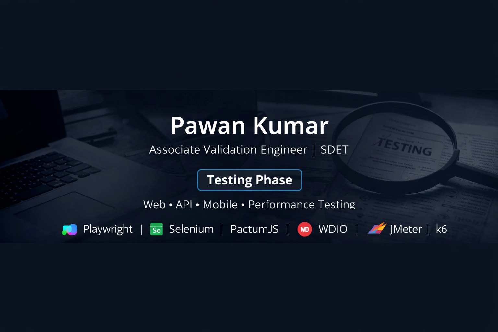

# Hi 👋, I'm Pawan Kumar

### Associate Validation Engineer | Automation Test Engineer (SDET)

Detail-oriented Automation & Manual Test Engineer with **2+ years of experience** in testing **Web, API, and Mobile applications**.  
Experienced in building scalable automation frameworks and ensuring high-quality software delivery.

---

## 👨‍💻 About Me

- 🧪 Associate Validation Engineer with 2+ years of experience  
- 🌐 Web automation using **Playwright (TypeScript)** & **Selenium (Java, Python)**  
- 📱 Mobile automation using **WebdriverIO (WDIO)**  
- 🔗 API automation using **PactumJS with Mocha**  
- ⚡ Performance testing using **JMeter & k6**  
- 🚀 Strong in manual testing, regression, and defect analysis  

---

## 🛠️ Skills & Tools

**Automation:** Playwright, Selenium, WebdriverIO  
**API:** PactumJS, Mocha, REST APIs  
**Performance:** JMeter, k6  
**Languages:** Java, Python, JavaScript, TypeScript  
**Tools:** Git, GitHub, Postman, CI/CD  
**Methodology:** Agile / Scrum  

---

## 📌 Featured Work

- Web Automation Framework – Playwright + TypeScript  
- API Automation Framework – PactumJS + Mocha  
- Mobile Automation – WDIO  
- Performance Testing – JMeter & k6  

---

## 📫 Contact Me

📧 **Email:** pawansinghania17@gmail.com  
💼 **LinkedIn:** https://www.linkedin.com/in/pawan-kumar-137833113  

---

⭐ *Always focused on quality, automation excellence, and continuous improvement.*
